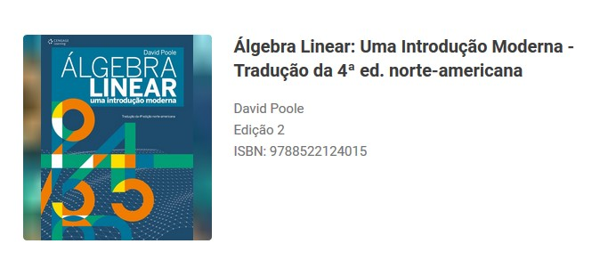

## Download de imagens de páginas de ebook
Automatiza o screenshot de páginas de ebooks da biblioteca virtual cengagebrasil/vitalsource com __[selenium](https://selenium-python.readthedocs.io/)__ e __python__
<br>

*Desenvolvido com intuito de estudo de web-scraping, recomendo que não comercialize ou matenha cópias não autorizadas de livros*

- - -
### O que é necessário?
1. Python e Selenium
2. Conta com acesso ao livro(s)
2. Número ISBN do livro
3. Número da página inicial

#### INSTALAR O SELENIUM
Faça o download da versão mais atualizada do __chromedriver__(chrome) ou __geckodriver__(firefox - necessário pequenas alterações no código)

*Instalando o Selenium*
```python
pip install -U selenium
```

#### VERIFICAR NÚMERO ISBN DO LIVRO
Existem duas formas:
1. Através da própria url: cengagebrasil.vitalsource.com/#/books/`9788522124015`
2. Por meio da página do livro OU internet:



#### NÚMERO DA PÁGINA INICIAL
Abra o ebook e com auxilio do navegador inspecione a página e encontre o iframe#epub-content:


> *Veja que ali também é possível visualizar o ISBN*
---
### Utilize o próprio recurso(Imprimir) do Windows para transformar as imagens em PDF
Selecione todas as imagens, clique na primeira(capa) imagem com o botão direito e Imprimir, configure e salve como pdf.

### Salvando várias vezes a mesma página(capa/contracapa/etc)
Isto demonstra estar perto do limite de acessos, recomendo colocar um número maior de páginas, após um período verificar se já baixou a ultima página.
Caso as screenshots estejam sendo salvas como páginas em branco significa que existe um captcha. Tente novamente depois de algumas horas, ou __baixe manualmente, inspecionando elementos e salvando fácilmente a página__.

- - -

*Sinta-se livre para contribuir!*
